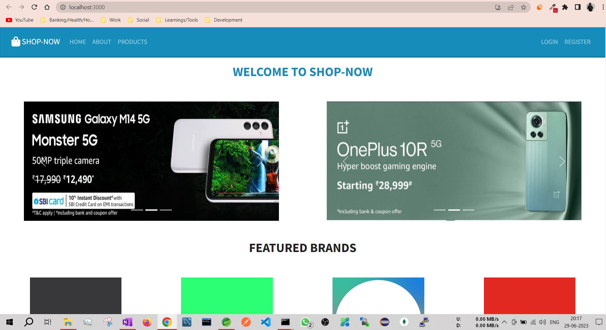
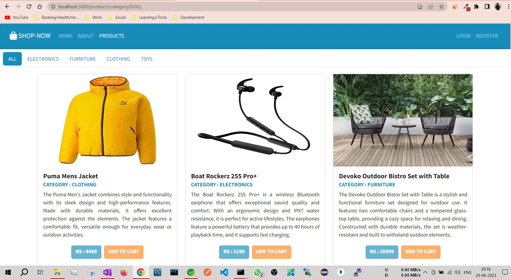
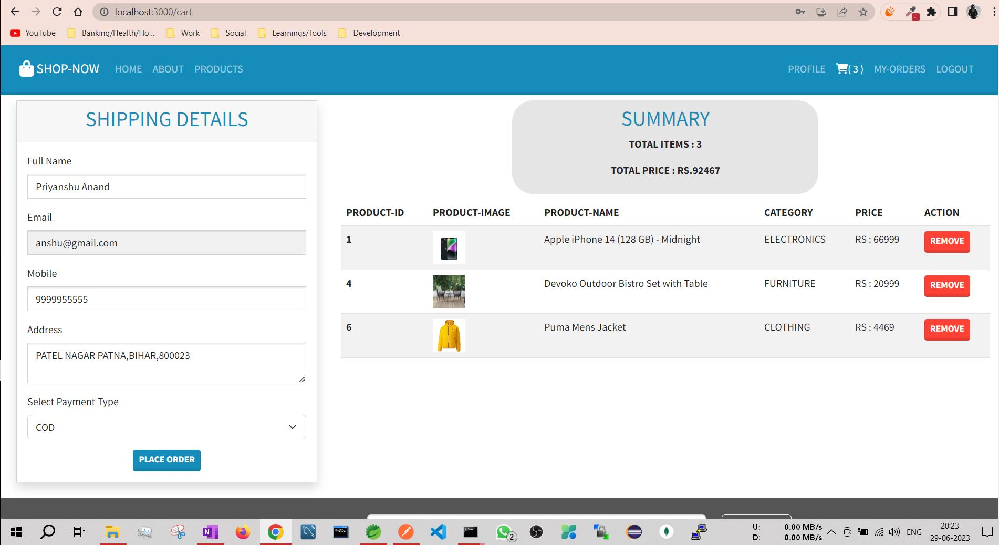
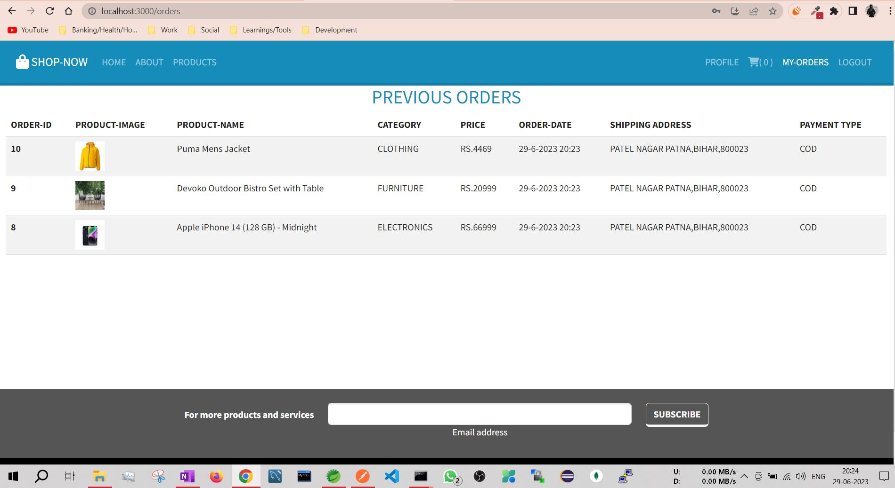
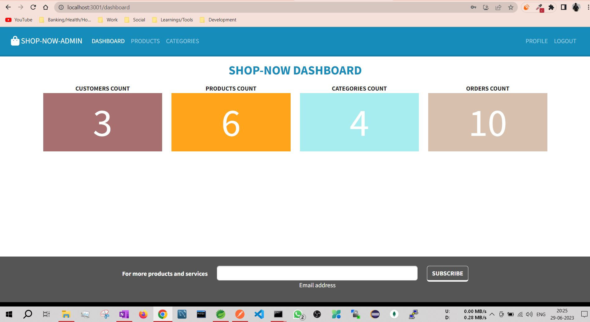
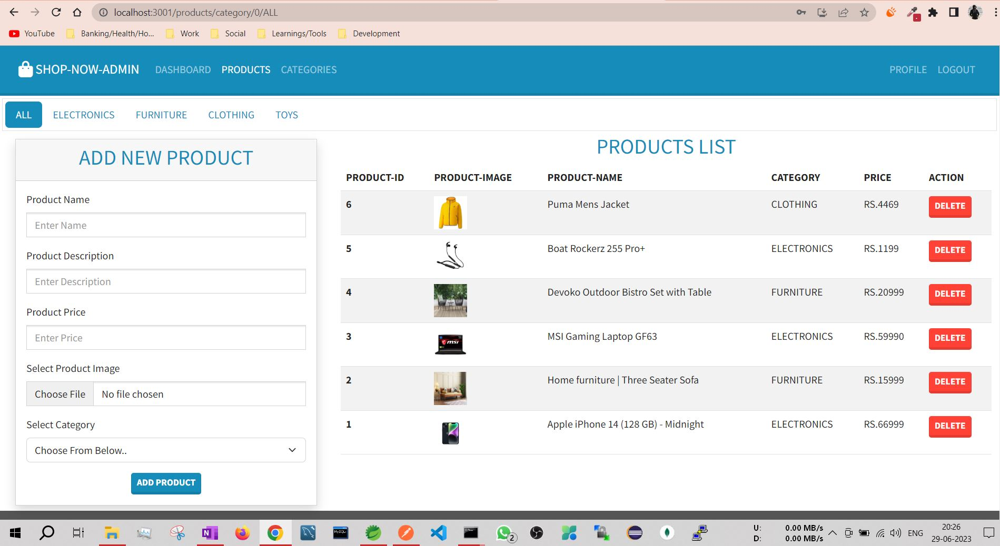
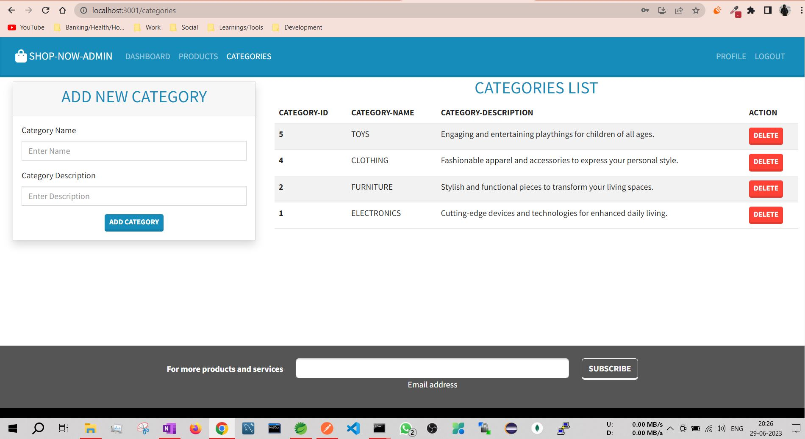
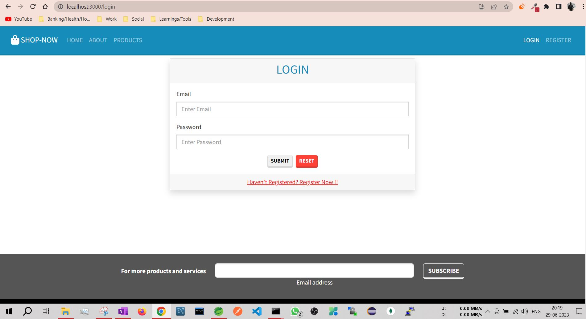
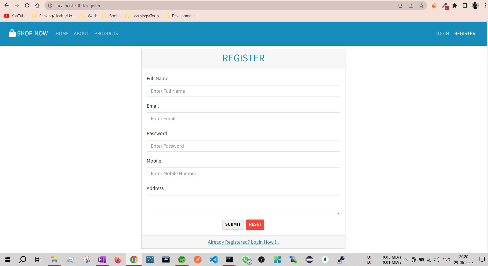

# ShopNow
"ShopNow is an advanced e-commerce application built using React and Spring Boot. It follows a microservice architecture to ensure scalability and flexibility. The application provides a seamless shopping experience with features like product browsing, cart management, etc. With a user-friendly interface and responsive design, ShopNow caters to a wide range of customers.The project demonstrates proficiency in front-end and back-end development, emphasizing clean code practices and efficient system design. Explore the future of online shopping with ShopNow."
 
#### HOME PAGE


#### PRODUCTS PAGE


#### CART PAGE


#### ORDERS PAGE


#### ADMIN DASHBOARD


#### ADMIN MANAGE PRODUCT


#### ADMIN MANAGE CATEGORY


#### LOGIN PAGE


#### REGISTER PAGE


### QUICK GUIDE/STEPS TO RUN THE PROJECT [ BACKEND ]:
1. Clone the project.
2. Download "STS [ Spring Tool Suite ] IDE and Configure It.
3. Download/Install/Configure Java 11 or above.
4. Download and install MySQL installer community [ Workbench, MySQL command line ,MySQL Server ]
5. Download and Configure Tomcat 9.0 [ Optional ].
6. The Projects needs to have database created as below and rest of the table creation will be taken care by Hibernate itself : 

```
create database shopnow;
```
7. Open STS IDE and import each and every separate spring boot project present inside [ shopnow-backend ] directory ,and run the project as SpringBoot App.

### QUICK GUIDE/STEPS TO RUN THE PROJECT [ FRONTEND ]:
1. Install NodeJS and Node Package Manager, Move inside [shopnow-frontend] folder and open it in vscode and Run npm install , npm start
2. Visit http://localhost:3000/home for home page in your browser [ This will be normal user module ]
3. Move inside [shopnow-frontend-admin] folder and open it in vscode and Run npm install , npm start  [ This will be admin module ] which will be accessible at http://localhost:3001
4. Note : To login as admin you need to manually change the "isadmin" attribute inside the database to true for any of the user registered.

Enjoy ShopNow E-commerce Application !! 😊
